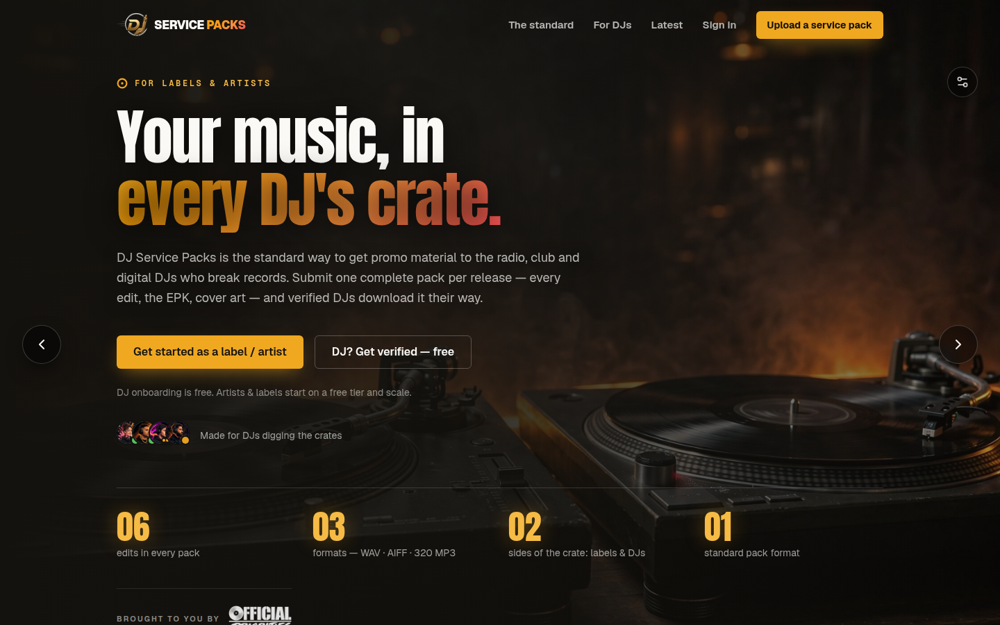

# DJ Service Packs

> *Your music, in every DJ's crate.*

[](https://djservicepacks-sandbox-cxwk-git-design-jonf822-projects.vercel.app/)

**Live preview (design branch):** https://djservicepacks-sandbox-cxwk-git-design-jonf822-projects.vercel.app/



DJ Service Packs is the standard way to get promo material to the radio, club and digital DJs who break records. Labels and artists submit one complete pack per release — every edit, the EPK, cover art — and verified DJs download it their way.

## What's inside

- **Hero with dual onboarding** — labels/artists and DJs each get their own dark in-page signup modal (no page jumps); standalone `/onboarding/artist` and `/onboarding/dj` pages cover invite and deep-link flows.
- **Demo shelf** — filter the pack shelf by genre and format with big touch-friendly pill controls (44px targets, built for phones).
- **Waveform players** — every pack gets its own uniquely seeded waveform under a shared aurora treatment (wavesurfer.js).
- **DJ verification** — free registration with admin-checked verification before high-bitrate downloads unlock.
- **Label/artist plans** — tiered plans from free up through pro, with Stripe billing.
- **Dashboards** — DJ and label/artist dashboards, release management, and an admin lane.
- **Security** — Cloudflare Turnstile on signup, Firebase auth, admin-gated verification.

## Design language

- Dark charcoal surfaces, warm paper text, amber/gold accents.
- Rounded, pill-shaped controls throughout — the filter pills set the tone.
- Aurora gradients and glow on interactive moments (waveforms, CTAs, modals).
- Mobile-first touch targets: 44px minimum on every tappable control.

## Tech stack

| Layer      | Tech                                                        |
|------------|-------------------------------------------------------------|
| Framework  | Next.js 16 (App Router), React 19, TypeScript                |
| Styling    | Tailwind CSS 4                                              |
| Auth       | Firebase Auth (client + Admin SDK)                          |
| Payments   | Stripe                                                      |
| Bot guard  | Cloudflare Turnstile                                        |
| Audio      | wavesurfer.js                                               |
| Storage    | AWS S3 (presigned uploads)                                  |
| Email      | Nodemailer / IMAP                                           |
| Hosting    | Vercel (preview per branch)                                 |

## Project structure

```
├── public/                  # static assets
├── server.js                # custom server entry
├── src/
│   ├── app/
│   │   ├── admin/           # admin lane
│   │   ├── api/             # API routes (backend lane — hands off)
│   │   ├── dashboard/       # DJ + label/artist dashboards
│   │   ├── invite/          # invite-link flows
│   │   ├── login/
│   │   ├── onboarding/      # artist + DJ signup pages (dark wrappers)
│   │   ├── releases/
│   │   ├── globals.css
│   │   ├── layout.tsx
│   │   └── page.tsx         # homepage: hero, demo shelf, pricing
│   ├── components/
│   │   ├── godui/           # filter bar + demo shelf UI
│   │   ├── onboarding/      # shared artist/DJ forms + modal shell
│   │   └── ui/              # shared primitives
│   ├── lib/                 # backend lane — hands off
│   └── proxy.ts
└── assets/
    └── screenshot.png       # dark-mode hero (refreshed on every build change)
```

## Branch workflow

- **`main`** — production / engine lane. App code here is not touched by design work.
- **`design`** — the active design branch. Every push here gets a Vercel preview deploy; this is where all visual and UX iteration happens.
- Changes land on branches, never by overwriting — no PRs unless asked.

*Screenshots stay current: `assets/screenshot.png` is refreshed in dark mode whenever the build changes.*
